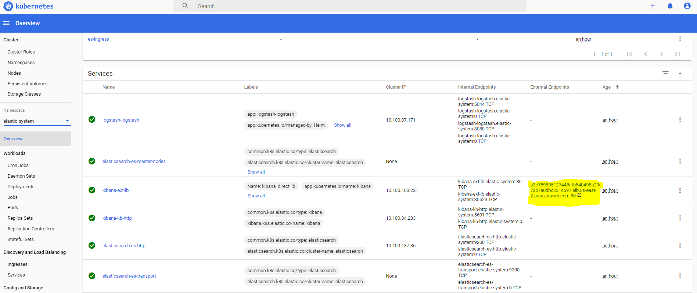
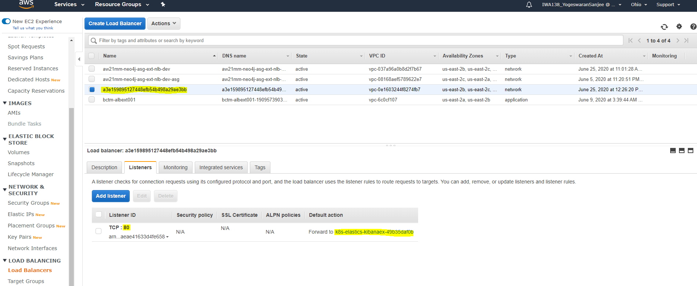

Table of Contents
=================

   * [Overview](#overview)
   * [Prerequisites](#prerequisites)
               * [config kubectl context to EKS created cluster](#config-kubectl-context-to-eks-created-cluster)
   * [Procedure](#procedure)
      * [Create EKSCTL Cluster](#create-eksctl-cluster)
      * [Cluster Autoscaler Configuration](#cluster-autoscaler-configuration)
      * [Quick Bootstrap](#quick-bootstrap)
      * [Kubernetes Dashboard](#kubernetes-dashboard)
   * [Pre-deployment Configuration](#pre-deployment-configuration)
      * [Elastic Cloud](#elastic-cloud)
         * [Logstash Configuration](#logstash-configuration)
         * [Route53 Endpoint](#route53-endpoint)
         * [Load Balancer Endpoint](#load-balancer-endpoint)
         * [Accessing the Kibana Dashboard](#accessing-the-kibana-dashboard)
            * [K8s dashboard](#k8s-dashboard)
            * [AWS Dashboard](#aws-dashboard)
         * [Resource Management](#resource-management)
      * [Granting other IAM users rights to access EKS](#granting-other-iam-users-rights-to-access-eks)
         * [EKSCTL](#eksctl)
         * [General EKS](#general-eks)
         * [sample yaml](#sample-yaml)
      * [Neo4J](#neo4j)
         * [Initcontainer Configuration](#initcontainer-configuration)
         * [Neo4J Configuration](#neo4j-configuration)
         * [Neo4J Helpful Commands](#neo4j-helpful-commands)
         * [Deployment](#deployment)
   * [Cleanup](#cleanup)
      * [Delete cluster](#delete-cluster)
      * [delete kubectl context](#delete-kubectl-context)
   * [References](#references)

# Overview

This repo is to setup elastic cloud on kubernetes (ECK) on elastic kubernetes service on AWS(EKS), using nginx-ingress and cert-manager for https access to Kibana.

A sample eksctl kubernetes cluster configuration file is in `cluster.yaml` in the root directory.

This can be used to set up a kubernetes cluster with enough resources provisioned for elastic cloud. This also takes advantage of spot instances, as k8s will redeploy nodes as necessary if spot instances go down.

# Prerequisites

* kubectl
* helm
* eksctl
* awscli
  
##### config kubectl context to EKS created cluster 
[[reference link]](https://docs.aws.amazon.com/eks/latest/userguide/create-kubeconfig.html)

```bash
# aws eks --region region-code update-kubeconfig --name cluster_name
aws eks --region us-east-2 update-kubeconfig --name eck_dev
```


# Procedure

## Create EKSCTL Cluster

cluster.yaml will have configuration

* creates vpc
* creates eks cluster name
* creates eks kubernetes control plane
* creates autoscaling group for each NodeGroup
* creates IAM roles
* creates spot requests (if configured)
  
```bash
# check cluster.yaml for configuration
eksctl create cluster -f cluster.yaml
```
## Cluster Autoscaler Configuration
In cluster-autoscaler-autodiscover.yaml, the eks cluster name needs to be set for autodiscovery near the bottom of the file.

## Quick Bootstrap

Run `bootstrap.sh` from the root directory to install all Cloud Services k8s infrastructure onto the k8s
cluster specified in your kubeconfig file.

Before proceeding, review the information in the Pre-deployment Configuration section below.  
This section provides information on how to overwrite and configure the 
Elastic Cloud (Kibana logging service) setup along with the K8s infrastructure.

```bash
./bootstrap.sh
```

## Kubernetes Dashboard

Check AWS EKS documentation for latest information

[[kubernetes dashboard tutorial]](https://docs.aws.amazon.com/eks/latest/userguide/dashboard-tutorial.html)


```bash
# get authorization token
kubectl -n kube-system describe secret $(kubectl -n kube-system get secret | grep eks-admin | awk '{print $1}')
# proxy into kubernetes cluster
kubectl proxy
```

[[kubernetes dashboard]](http://localhost:8001/api/v1/namespaces/kubernetes-dashboard/services/https:kubernetes-dashboard:/proxy/#/login)
# Pre-deployment Configuration

## Elastic Cloud

### Logstash Configuration

* This can be modified in `values.yaml` the logstash folder
* It is pasted inline into the file

### Route53 Endpoint
With a route53 DNS, nginx-ingress can route traffic to Kibana, secured with https using cert-manager.

The subdomain name that nginx-ingress will route traffic to is configured in `k8s/ingress/kibana.yaml`. In route 53
there should be a corresponding subdomain that points to the nginx-ingress load balancer that is created.

### Load Balancer Endpoint
Access to kibana can be obtained directly without using nginx-ingress with this yaml. However there will not be any https.

```kubectl apply -f ext-lb.yaml```

### Accessing the Kibana Dashboard
The Kibana Dashboard can be accessed using the URL linked to either of the AWS Load Balancers mentioned above.
A login is required to access the dashboard.  It is configured in the _eck/admin.yaml_ file. 

This login can be created by running the following commands with docker
```aidl
# create a folder with the 2 files
mkdir filerealm
touch filerealm/users filerealm/users_roles

# create user 'myuser' with role 'monitoring_user'
docker run \
    -v $YOUR_PASSWORD/filerealm:/usr/share/elasticsearch/config \
    docker.elastic.co/elasticsearch/elasticsearch:7.8.0 \
    bin/elasticsearch-users useradd myuser -p mypassword -r monitoring_user

# create a Kubernetes secret with the file realm content
kubectl create secret generic my-file-realm-secret --from-file filerealm
``` 
[[Reference]](https://www.elastic.co/guide/en/cloud-on-k8s/master/k8s-users-and-roles.html)

Use the Route53 DNS name to access the dashboard if a DNS name is available.
Use the Direct Load Balancer's URL to access the dashboard if no Route53 DNS is available.
You can use one of the following methods to get the Direct Load Balancer's URL:

#### K8s dashboard
Through the k8s dashboard under 'services' in the elastic-system namespace.  Only one of the services will have an external endpoint for kibana in that namespace. That is the direct load balancer.


#### AWS Dashboard
1. From the AWS Dashboard, load the EC2 Service.
2. Select the __Load Balancers__ link from the scroll window on the left side of the page.
3. Find the load balancer with a random name similar to a559696a92f30475f83fd11adf1477d5, Type=network.
4. Select the Load Balancer and click the __Listeners__ tab at the bottom of the screen.  If the __Default action__ field is set to "Forward to k8s-elastics-kibanaex...", this is the correct load balancer.
5. Click the __Description__ tab, the __DNS name__ fields is the URL used to access the Load Balancer.  Example value: a559696a92f30475f83fd11adf1477d5-6c6c02eb74d44a14.elb.us-east-2.amazonaws.com.




### Resource Management

* Resources for various components of the ELK stack can be modified in their respective yamls

## Granting other IAM users rights to access EKS

### EKSCTL

* https://eksctl.io/usage/iam-identity-mappings/

### General EKS

* https://aws.amazon.com/premiumsupport/knowledge-center/amazon-eks-cluster-access/
* https://docs.aws.amazon.com/eks/latest/userguide/add-user-role.html

### sample yaml

* mapUsers section will need to be updated.
* mapRoles section should not be copied
* mapRoles are for the NodeGroups which will be unique for each cluster.

```yaml
kind: ConfigMap
apiVersion: v1
data:
  mapRoles: |
    - groups:
      - system:bootstrappers
      - system:nodes
      rolearn: [node arn] 
      username: system:node:{{EC2PrivateDNSName}}
    - groups:
      - system:bootstrappers
      - system:nodes
      rolearn: [node arn] 
      username: system:node:{{EC2PrivateDNSName}}
  mapUsers: |
    - userarn: [your arn] 
      username: Sanjee
      groups:
      - system:masters
```

## Neo4J 

### Initcontainer Configuration

* This s3 bucket is described in the restore.sh file
* This docker image should be built and uploaded to elastic container registry(ECR)

Basic instructions for pushing initcontainer to ECR can be found here:
https://docs.aws.amazon.com/AmazonECR/latest/userguide/docker-basics.html

### Neo4J Configuration

* values.yaml file in helm-neo4j folder can be updated. Current values are set appropriately for our needs, but could be optimized.
* Some template files could be updated in order to include deployment of load balancer automatically.

### Neo4J Helpful Commands

```bash
# collect information about specific neo4j pod
kubectl get pod bformat-neo4j-core-0 -n neo4j
kubectl describe pod bformat-neo4j-core-0 -n neo4j

# collect logs during initialization process
kubectl logs bformat-neo4j-core-0 -n neo4j -c init-plugins
kubectl logs bformat-neo4j-core-0 -n neo4j -c neo4jinit
```

[[reference]](https://kubernetes.io/docs/tasks/debug-application-cluster/debug-init-containers/)

### Deployment

* values.yml should have pointer to ECR initcontainer
* helm install <name> --namespace <namespace> .
* Above command will deploy neo4j cluster to k8s.

# Cleanup

## Delete cluster

[[reference]](https://docs.aws.amazon.com/eks/latest/userguide/delete-cluster.html)

```bash
# delete any services that have an associated EXTERNAL-IP value
kubectl get svc --all-namespaces
kubectl delete svc service-name

# delete cluster
eksctl delete cluster --name eck_dev
```

## delete kubectl context

```bash
# gets all kubectl context configured
kubectl config get-contexts
# delete specific context
kubectl config delete-context [arn]
```

# References

* https://kubernetes.io/docs/concepts/configuration/manage-resources-containers/

